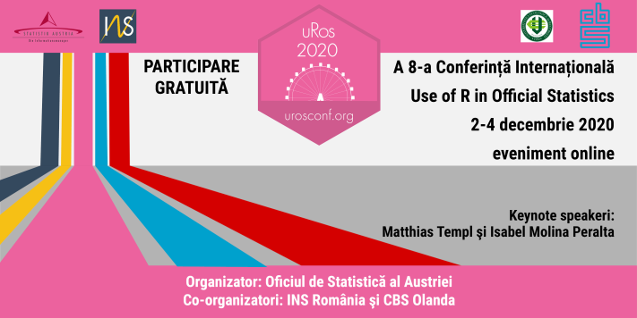
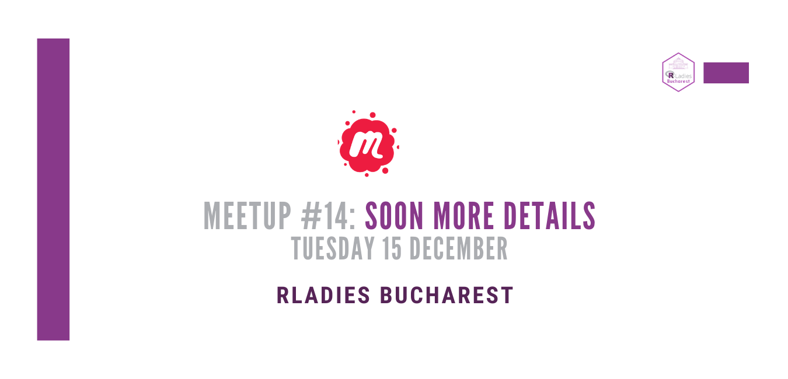

class: inverse, center, middle
# Mișcare globală care promovează egalitatea de șanse în comunitatea de .purple[`r icon::fa("r-project", size=1)`] prin întâlniri, networking și sesiuni de lucru aplicate într-un mediu sigur și prietenos.

Please read and respect our .purple[Global Code of Conduct] [`r anicon::faa("arrow-right", colour="#88398A", animate="horizontal",rtext="here")`](https://www.rladies.org/code-of-conduct)

---
class: center, middle
--
###Urmărește `r anicon::faa("twitter", colour="#88398A", animate="float",rtext="@WeAreRLadies")` pe twitter

--
###Înscrie-te în directorul de membri [R-Ladies](https://rladies.org/r-ladies-directory-form)

--
###Participă la discuțiile din Slack

--
.purple[SPREAD THE WORD!] 

--
.grey[TELL YOUR FRIENDS] 

---
class: inverse, center, middle

--
.red[#urosconf2020]

--

--
### Follow event: https://bit.ly/2HjQpUp

---
class: inverse, center, middle

--
.purple[#nextmeetup] Tuesday, 15 December

--

--
### Follow event: https://www.meetup.com/rladies-bucharest/events/273541033/

### Tentative idea, book your participation:  shorturl.at/fqFX6

---

class: center, middle

#Follow us

--
###`r anicon::faa("meetup",colour="#ed1c40", animate="float",rtext="@RLadies-Bucharest")` 

--
###`r anicon::faa("twitter", colour="#1da1f2", animate="float",rtext="@rladiesbucares")`

--
###`r anicon::faa("facebook", colour="#3b5998", animate="float",rtext="RLadiesBucharest")`

# Thanks!

Slides created using the R package [**xaringan**](https://github.com/yihui/xaringan)
and the theme [**Kunichio**](https://github.com/emitanaka/ninja-theme).

---

class: center, middle
#Agenda

--
###`r anicon::faa("github",colour="#211F1F", animate="float",rtext="7.10 PM Git & Github for R Users")`
Ana-Maria Niculescu, Data Scientist @ Numeract, Co-Founder Bucharest WiMLDS

--
###`r anicon::faa("r-project",colour="#88398A", animate="float",rtext="7.40 PM Raspberry Pi & R")`
Frie Preu, Data Scientist @ CorrelAid
